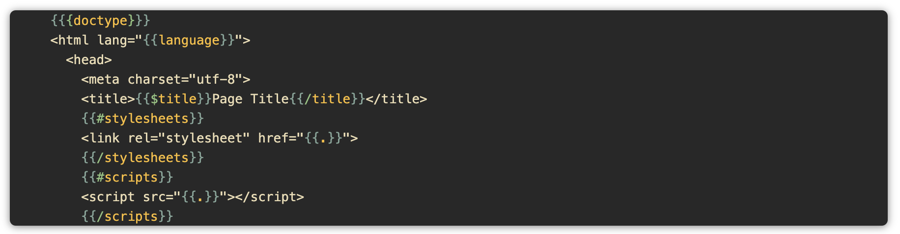

# Mustache for Visual Studio Code

Mustache language support for Visual Studio Code.



## Motivation

While there are already multiple extensions providing Mustache language support for Visual Studio Code, I had trouble finding an extension that is actively maintained and recognizes syntax from the latest language specification. Additionally I had a need for isolation of the Mustache grammar against the source text. This grammar solves those problems by supporting the latest features and extending a plain text grammar rather than HTML.

## Features

* Supports version 1.3.0 of the [Mustache language specification](https://github.com/mustache/spec).
* Scopes the pieces of each Mustache tag separately for quick recognition.
* Toggles comments with the built-in shortcut keys `CMD + /` or `CTRL + /`.
* Automatically closes opening curly brackets `{` as you type.

## Troubleshooting

If after installing this extension, the curly braces are rainbow colors, and don't look like the preview picture above, it is likely because you have bracket pair colorization enabled. You can disable this for mustache files only by adding the following to settings.json:

```json
  "[mustache]": {
    "editor.bracketPairColorization.enabled": false
  },
```
